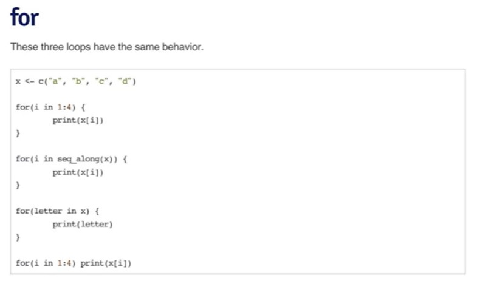

# Control structures and functions

------------------------------------------------------------------------

## Control structures

### ***Control structures summary***


Another summary:


------------------------------------------------------------------------

### ***if-else***

Example:


```{r}
# read dataframe from the 1st module
df <- read.csv("data/hw1_data.csv")
df
```

```{r}
if( sum(is.na(df$Ozone)) > 0 ) {
  na_num <- sum(is.na(df$Ozone))
  df_no_na <- complete.cases(df)
  no_na <- df[df_no_na, ][]
  paste("Number of rows removed where Ozone has missing values: ", na_num)
} else {
  print("No missing values")
}
```

> There also can be a specific form of **if-else** construction like this:

```{r}
# assign the whole construction as a value
check_nan <- if( sum(is.na(df$Ozone)) > 0 ) {
  na_num <- sum(is.na(df$Ozone))
  df_no_na <- complete.cases(df)
  no_na <- df[df_no_na, ][]
  paste("Number of rows removed where Ozone has missing values: ", na_num)
} else {
  print("No missing values")
}

# call the whole construction
check_nan
```

------------------------------------------------------------------------

### ***for loop***

Example:


Different types of for loops:

> **seq_along()** function is used when it is useful to take the length of the sequence to be looped. Creates integer sequence of indices like 1:4



#### Nested loops

Let's iterate through the matrix using nested loops:

```{r}
matr <- matrix(1:16, 4, 4)
for(i in seq_len(nrow(matr))){
  for(j in seq_len(ncol(matr))){
    print(matr[i, j])
  }
}
```

------------------------------------------------------------------------

### ***while loop***

Example on the while loops:


Flipping coin while loop example:

> We don't know when does this loop *finishes*!


------------------------------------------------------------------------

### ***repeat, next, break***

#### *repeat*

Hardly ever used in data science, because it's hard to predict when does loop stops:


> above: **computeEstimate()** is NOT a real function

#### *next, return*

**next** is used to skip an iteration of a loop.


## Functions

Functions are usually created in separate *.R* files.

> R functions always return the **last** expression calculated. If there is only one expression calculated, we don't need to provide a *return* structure.

> We can specify the default parameter value of the function like this $above = function(x, n = 10)$

Some of the created functions in a separate file:

```{r}
add2 <- function(x, y) {
  x + y
}
```

```{r}
# takes vector as an input
above10 <- function(x) {
  # logical vector of elements, that > 10
  use <- x > 10
  # apply this subset to the vector
  x[use] 
}
```

```{r}
# analogical to the prev one
# takes vector and higher border as an input
above <- function(x, n) {
  # logical vector of elements, that > n
  use <- x > n
  # apply this subset to the vector
  x[use] 
}
```

call it

```{r}
x <- 1:20
above(x, 15)
```

the other one takes dataframe and counts means of each column

```{r}
# made a remake with removing Na by default
# takes matrix or dataframe as an input
column_mean <- function(y, removeNA = TRUE) {
  # calc num of cols
  n_col <- ncol(y)
  # store the means in the vector in the size of the columns num 
  means_vector <- numeric(n_col)
  # looping through the columns
  for(i in 1:n_col){
    # columns [,i]
    means_vector[i] <- mean(y[ ,i], na.rm = removeNA)
  }
  #last expression would be returned
  means_vector
}
```

