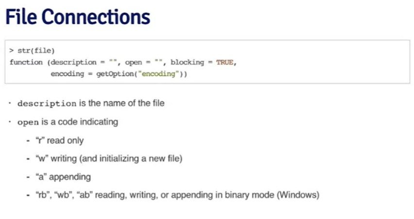

---
---
---

## Tasks on the R datatypes

------------------------------------------------------------------------

### Datatypes

**There are 5 datatypes:**

```{r}
# numeric (decimal, double precision)
numeric1 <- c(0.5, -0.2)
numeric1
# logical (both forms acceptable)
logical1 <- c(T, FALSE)
logical1
# character
character1 <- c("ABC", "d", "EF", "#$&^*")
character1
# integer
integer1 <- c(0:13)
integer1
# complex
complex1 <- c(1 + 2i, 3 + 10i)
complex1
```

> it can be converted to the specified type

```{r}
class(numeric1)
numeric1 <- as.character(numeric1)
numeric1
class(numeric1)
```

> To get an integer type like **3L**

```{r}
x <- 3L
x
class(x)
```

------------------------------------------------------------------------

### Lists and vectors

#### *Vectors (Only one datatype)*

> If there is more than one datatype in vector, coersion occurs. It may cause \> error or not.

```{r}
# function c() creates vector
vector1 <- c(1.2, 1.3, 1.4)
vector1
```

> **":"** can be used for **integer** sequence only!

```{r}
# ":" can be used for integer sequence only! 
vector2 <- c(1:13)
vector2
```

The other way to create vector (creates empty vector):

```{r}
vector3 <- vector("character", length = 15)
vector3
```

#### *Lists (different datatypes within one list, list is also considered as vector)*

> Lists have elements' indexing from 1

```{r}
list1 <- list(1:5, "Ef", "$#", 1.2, 1 + 4i)
list1
```

```{r}
list1[3]
```

------------------------------------------------------------------------

### Matrices (special type of *vector*)

Empty matrix:

```{r}
matr1 <- matrix(nrow = 4, ncol = 4)
matr1

#matrix dimensionality
dim(matr1)

#attributes, dimensionality is first
attributes(matr1)

```

Creating filled-in matrix

```{r}
matr2 <- matrix(-1:14, nrow = 4, ncol = 4)
matr2
attributes(matr2)
```

> Matrix can also be created from vector

```{r}
values <- -1:14
dim(values) <- c(4, 4)
values
```

Construct matrix by **binding**:

> **Column-binding:**

```{r}
col1 <- 1:10
col2 <- 11:20
col3 <- 21:30
cbind(col1, col2, col3)
```

> **Row-binding**

```{r}
row1 <- 1:10
row2 <- 11:20
row3 <- 21:30
rbind(col1, col2, col3)
```

------------------------------------------------------------------------

### Factors (to represent *categorical* data)

Vector of integers, where each *integer* has a *label* (categorical data).

```{r}
factor1 <- factor(c('category #1', 'category #2',  'category #1',  'category #3'))
factor1
# number of occurencies of each factor
table(factor1)
# convert to integer representation (change attribute level)
unclass(factor1)
```

> When you want to specify baseline, you can specify the first level

```{r}
factor2 <- factor(c('category #1', 'category #2',  'category #1',  'category #3'),
                  levels = c('category #1', 'category #2','category #3'))
factor2
```

### Missing values (*NA* and *NaN*)

Determine if objects are **NA**:

```{r}
# take previously created empty (NA) matrix
is.na(matr1)
```

Determine if objects are **NaN**:

```{r}
# the same matrix
is.nan(matr1)
```

> **NA** != **NaN**

### Data Frames (special list to store tabular data)

Create Data Frame:

```{r}
#read.table()
#read.csv()
```


> Convert Data Frame to matrix:

```{r}
#data.matrix()
```

**Another way** to create Data Frame (two columns):

```{r}
children <- data.frame(name = c("Sarah", "Daniel", "Connor"),
                       weight = c(5.6, 3.5, 10.4),
                       height = c(91, 80, 101))
children
```

```{r}
nrow(children)
```

```{r}
ncol(children)
```

------------------------------------------------------------------------

### Giving names to attributes

For all R objects is the same procedure

#### *Vectors' names*

```{r}
# we have some sequence
sequence1 <- 1:4
# we want to assign name to the attributes of sequence
names(sequence1) <- c("one", "two", "three", "four")
# show 
sequence1
# show labels only
names(sequence1)

```

#### *Lists' names*

Assigning names to each column separately:

```{r}
list2 <- list(a = 1:10, b = "Ef", c = "$#", d = 1 + 4i)
list2
```

Or to the list sequence:

```{r}
list3 <- list(col_A = 1:3,
              col_B = 4:6)
list3
```

#### *Matrices' names (row/col names)*

```{r}
matr2 <- matrix(-1:2, nrow = 2, ncol = 2)
dimnames(matr2) <- list(c("rowA", "rowB"), c("colA", "colB"))
matr2
```

------------------------------------------------------------------------

**Datatypes in R are as follows:**


------------------------------------------------------------------------

## Tasks on reading and writing data

There are following methods of reading data in R:


There are following methods of writing data in R:


------------------------------------------------------------------------

### *read.table* for small datasets

 

[***read.table*** **documentation**](https://www.rdocumentation.org/packages/utils/versions/3.6.2/topics/read.table)

```{r}
data <- read.table("data/test_txt.txt",
                   header = TRUE)
data
```

### *read.table* for large datasets

> **read.table** and **read.csv** read files into the RAM of the computer!


-   To optimize the work, once if there are no comments in file (lines starting from **\#**), set it in code **comment.char = ""**.

-   There is one more good optimization practice: setting the columns types:


> On the picture above we can see, that called **class** function. It works faster than auto determination.

------------------------------------------------------------------------

### dput() and dump()


#### *dput()*

> dget can be used on single R object!

dput objects

 Let's try this on the recently created DF:

```{r}
DF <- read.table("data/test_txt.txt",
                   header = TRUE)
dput(DF, 
     file = "out/dput_DF.R")
```

read it

```{r}
new.DF <- dget("out/dput_DF.R")
new.DF
```

and analogically

```{r}
children1 <- data.frame(name = c("Sarah", "Daniel", "Connor"),
                       weight = c(5.6, 3.5, 10.4),
                       height = c(91, 80, 101))
dput(children1,
     file = "out/dput_children1.R")
new.children1 <- dget("out/dput_children1.R")
new.children1
```

#### *dump()*

> dump can be used on multiple R objects!


------------------------------------------------------------------------

### Connection interfaces to read data


file connections:



> We could open connection if it's nedeed to read **parts** of the file.


Read lines of the webpage:


------------------------------------------------------------------------

### Subsetting

Subsetting operators:


Example of numerical and logical index:


#### Subsetting lists

```{r}
list3 <- list(a = 1:10, b = "Efa avfs", 
              c = "$#%^&6", d = 1 + 4i)
# taking by index
list3[2]
# take by col name
list3["a"]
# taking contents of the [2]
list3[[2]]
#taking contents of the col
list3$a
# the same as previous
list3[["a"]]

```

Extract *multiple* elements of the list:

```{r}
# provide it as a vector; get only 1 and 4
list3[c(1, 4)]
# get by name
list3[c("a", "d")]
```

> The [[]] can be used with *computed* indices!

> The \$ can be used *only* with literal names!


Nested elements of the list:


#### Subsetting matrices

```{r}
matr3 <- matrix(-1:2, nrow = 2, ncol = 2)
dimnames(matr3) <- list(c("rowA", "rowB"), c("colA", "colB"))
matr3

# take all elements of row 2
matr3[2, ]
# take all elements of col 2
matr3[, 2]
# take element by col and row names
matr3["rowA", "colA"]
```

> If it is one object returned, it returs not \*\*matrix 1\*1 **but** vector**. This can be turned off by setting** drop = FALSE\*\* in the subsetting string.


> If it is one row or column returned, it returs not **matrix** but **vector**. This can be turned off by setting **drop = FALSE** in the subsetting string as in previous example. **(x[1, , drop = FALSE])**

------------------------------------------------------------------------

#### Partial matching of the names

```{r}
list4 <- list(a = 1:10, boo = "Efa avfs", 
              c = "$#%^&6", d = 1 + 4i)
# look for the column by the name (partial)
list4$b
# no such col
list4[["b"]]
# look for the part
list4[["b", exact = FALSE]]
```

------------------------------------------------------------------------

#### Removing missing values

The basic practice of removing *NA* values is setting a vector of *NA* values.

```{r}
vector_na <- c(1, 3, NA, 4, 1, NA, NA)
# logical vector, that defines NA
na <- is.na(vector_na)
# without na
vector_na[!na]
```

There is other practice: showing non NA elements only:

```{r}
# taking two vectors
vector_na <- c(1, 3, NA, 4, 1, NA, NA)
vector_na2 <- c(1, NaN, NA, -1, 4, 2, NaN)
#using function of getting no NA
good_cases <- complete.cases(vector_na, vector_na2)
vector_na[good_cases]
print("other:")
vector_na2[good_cases]

```

> **complete.cases** igrores both *NA* and *NaN*!

**complete.cases** can be also used with *Data Frames*:


> **complete.cases** removes *all the row* with at least one *NA/NaN*

------------------------------------------------------------------------

### Vectorized operations

The main idea is in making *parallel* to that more *efficient* operations.

> There is no loop needed!


#### Vectorized matrix operations

