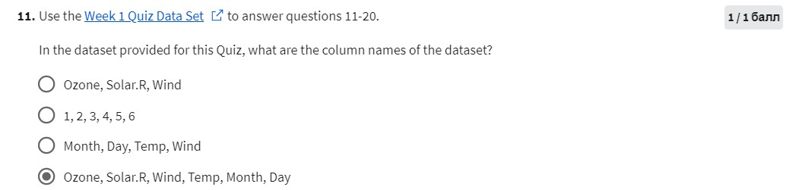
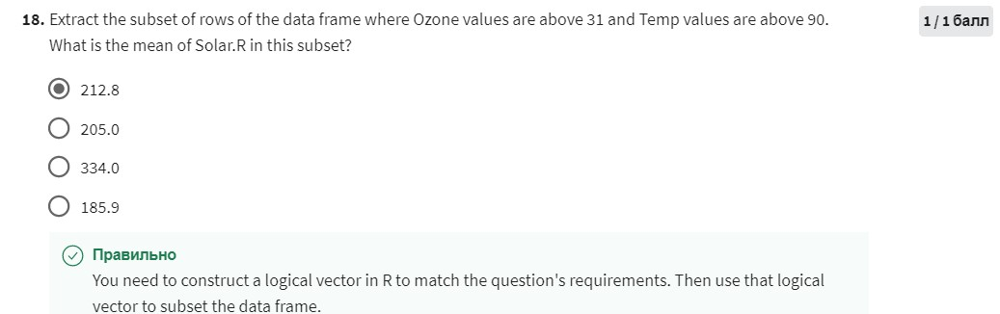
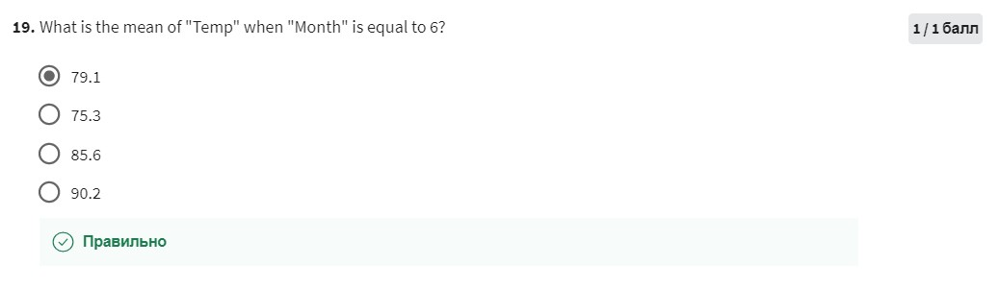
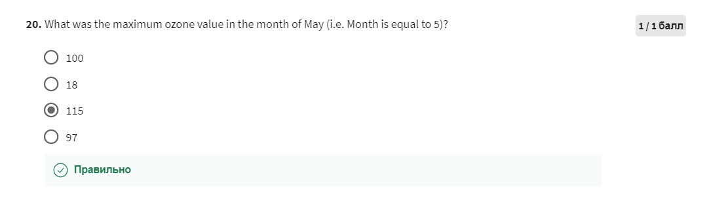

### 11

```{r}
df <- read.csv("data/hw1_data.csv")
names(df)
```
### 12-13

Get first/last elements
```{r}
#second row
df[2, ]
#last rows
tail(df)
```
### 14

Count rows number

```{r}
nrow(df)
```

### 15

Value of Ozone int the 47th row

```{r}
# row 47, col 1 (Ozon is 1st col)
df[47, 1]
```

### 16

How many missing values are in the Ozone column

```{r}
# take 1st column
sum(is.na(df[,1]))

```

### 17

What is the mean of the Ozon column

```{r}
df_no_na <- complete.cases(df)
no_na <- df[df_no_na, ][]
mean(no_na$Ozone)
```

### 18



```{r}
mean(subset(df, Ozone > 31 & Temp > 90)$Solar.R)
```

### 19



```{r}
df2 <- subset(df, df$Month == 6)
mean(df2$Temp)
```


### 20



```{r}
max(subset(no_na$Ozone, 
           no_na$Month == 5))
```

